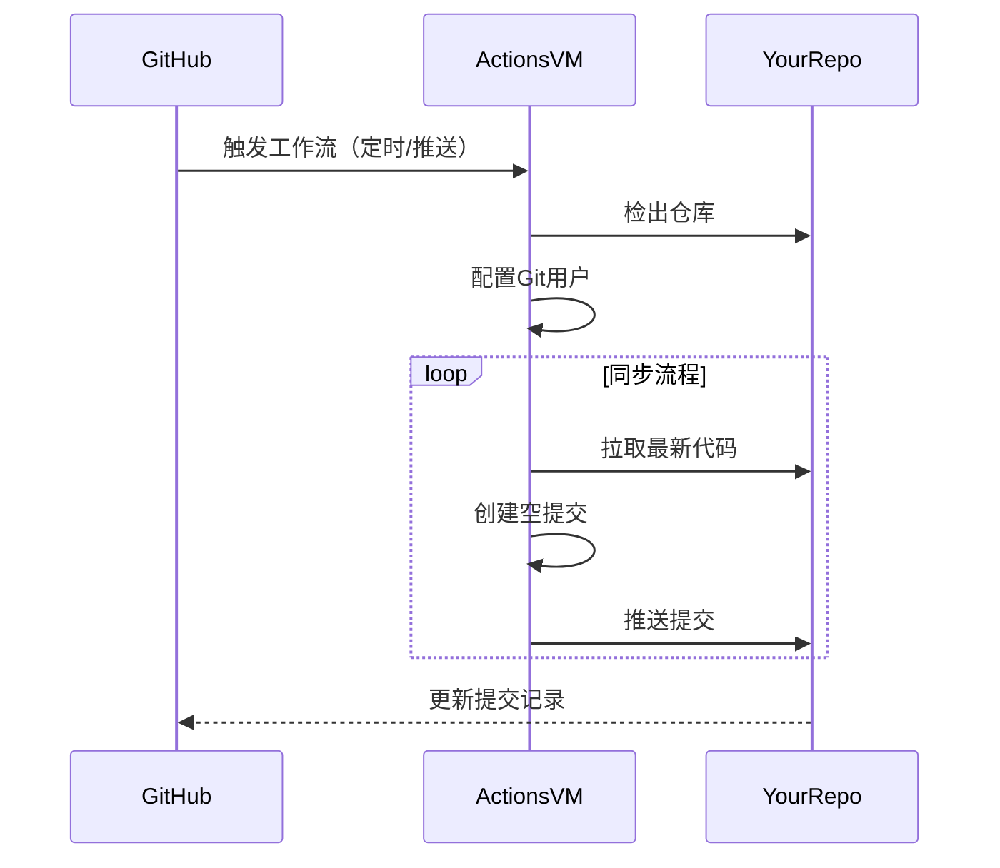

# Auto-Commit Bot with GitHub Actions 🤖

 


自动维护项目活跃度的GitHub Actions机器人，每日定时提交空commit，支持手动触发。

## 功能特性 ✨
- ⏰ 每日UTC时间00:00自动提交
- 🚀 支持`git push`到master分支时触发
- 🔒 使用安全令牌认证
- 🔄 自动同步远程仓库最新更改

## 部署指南 🛠️

### 步骤1：创建工作流文件
1. 在项目根目录创建 .github/workflows 文件夹
2. 新建 autocommit.yml 文件，复制以下内容：

```yaml
name: Springit 

on: 
  push: 
    branches: 
      - master 
  schedule: 
    - cron: '0 0 * * *'  # 每天 UTC 时间 00:00 触发 

jobs: 
  auto-commit: 
    runs-on: ubuntu-latest 
    permissions: 
      contents: write

    steps: 
    - name: Checkout repository 
      uses: actions/checkout@v4 
      with: 
        fetch-depth: 0 

    - name: Configure Git 
      run: | 
        git config --global user.name "username" 
        git config --global user.email "useremali" 

    - name: Pull latest changes 
      run: | 
        git remote set-url origin https://${{ github.actor }}:${{ secrets.GITHUB_TOKEN }}@github.com/${{ github.repository }} 
        git pull origin master

    - name: Auto-green  
      run: | 
        git pull --rebase origin master 
        git commit --allow-empty -m "Auto-commit by GitHub Actions" 
        git push origin master
```
## 部署指南 🛠️

### 步骤2：配置仓库权限
1. 进入仓库 Settings → Actions → General  
2. 在 "Workflow permissions" 部分：  
   - ✅ 选中 "Read and write permissions"  
   - ✅ 勾选 "Allow GitHub Actions to create and approve pull requests"  

---

### 步骤3：验证工作流程
1. 提交并推送更改到master分支  
2. 访问仓库的Actions标签页  
3. 应该看到 "Springit" 工作流正在运行  


---

## 工作原理 ⚙️

## 自定义设置 ⚡
1. 修改提交时间：调整`cron`表达式  
   ```yaml
   # 示例：每天北京时间08:00运行
   - cron: '0 0 * * *'  # UTC时间 → 北京时间+8
   ## 自定义设置 ⚡  
   ```
## 注意事项 ⚠️
1. 确保master分支允许Actions推送：  
  Settings → Branches → Branch protection rules  
   
2. 每日提交会显示在贡献日历中（绿色格子）  

3. 空提交不会影响实际代码，仅修改Git历史记录  

---

> 📌 **提示**：首次运行可能需要等待定时触发，或手动执行`git push`到master分支测试  

[GitHub Actions文档](https://docs.github.com/actions)
